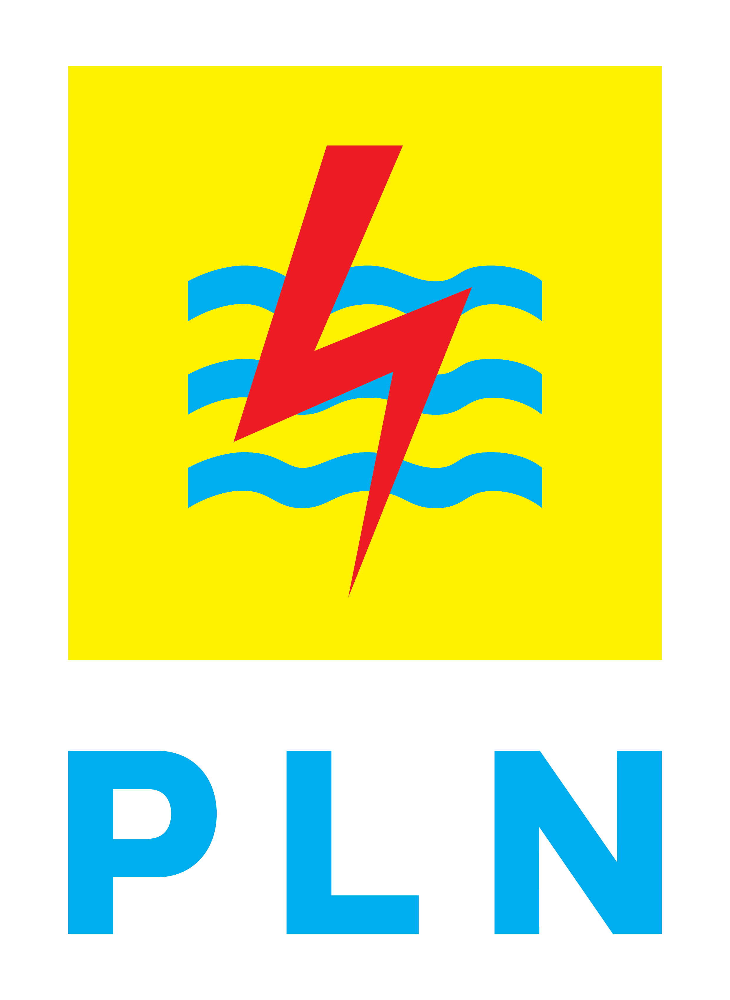
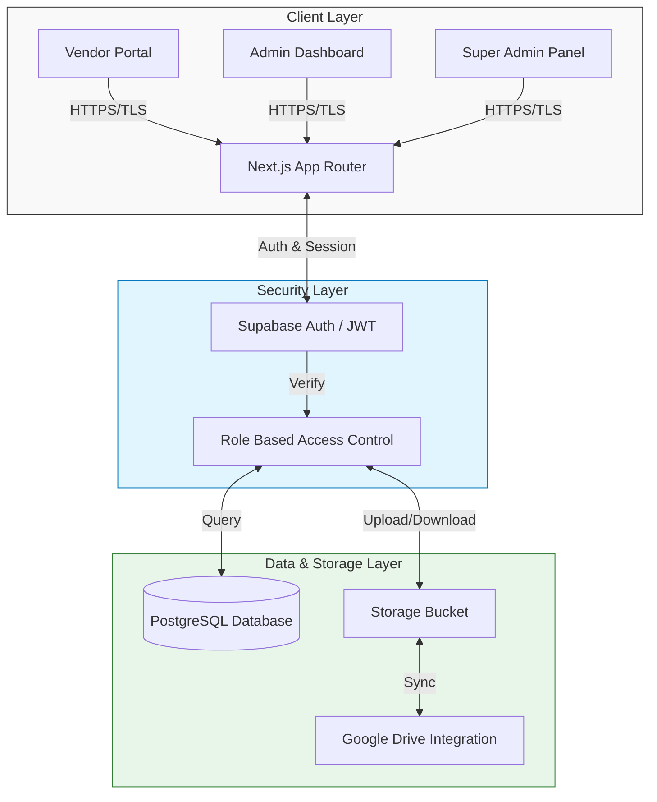
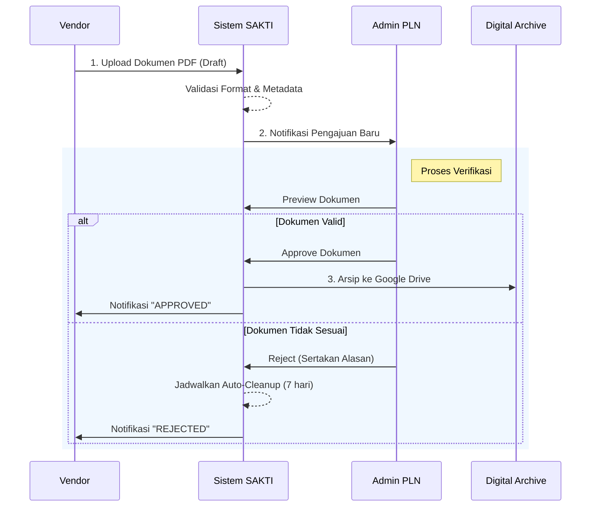

  
  &nbsp;&nbsp;&nbsp;&nbsp;
  
  &nbsp;&nbsp;&nbsp;&nbsp;
  

# SAKTI
**Sistem Administrasi Kontrak Terintegrasi**

 

 

**Platform Digital Enterprise untuk Manajemen Siklus Hidup Kontrak dan Arsip Vendor pada PT. PLN (Persero) UPT Manado**

---

## Ringkasan Eksekutif

**SAKTI (Sistem Administrasi Kontrak Terintegrasi)** merupakan inisiatif transformasi digital yang dikembangkan untuk memperkuat tata kelola administrasi kontrak di lingkungan PT. PLN (Persero). Sistem ini dirancang untuk menggantikan proses manual berbasis kertas menjadi ekosistem digital yang terpusat, aman, dan transparan.

Dengan menerapkan arsitektur *cloud-native* dan standar keamanan *enterprise*, SAKTI memfasilitasi kolaborasi tanpa hambatan antara Vendor (Penyedia Barang/Jasa) dan Manajemen PLN, memastikan kepatuhan terhadap regulasi (compliance), serta meningkatkan efisiensi operasional melalui otomatisasi alur kerja persetujuan dokumen.

---

## Arsitektur Sistem

Sistem SAKTI dibangun dengan arsitektur modern yang memisahkan *Frontend* (Client-Side) dan *Backend* (Serverless) untuk menjamin skalabilitas dan performa tinggi.

---

## Alur Proses Bisnis

Mekanisme operasional SAKTI mencakup siklus lengkap mulai dari registrasi vendor hingga pengarsipan dokumen kontrak secara permanen.

### Workflow Pengajuan & Persetujuan

---

## Spesifikasi Modul

### 1. Portal Manajemen Vendor
Modul antarmuka yang diperuntukkan bagi mitra kerja eksternal.
*   **Identitas Digital Perusahaan**: Pengelolaan data profil perusahaan (NPWP, Domisili, PIC) yang terverifikasi.
*   **Secure Document Submission**: Kanal pengunggahan dokumen kontrak terenkripsi dengan pembatasan tipe dan ukuran file.
*   **Real-time Tracking**: Pemantauan status dokumen secara waktu nyata (real-time) tanpa perlu menghubungi admin secara manual.

### 2. Dashboard Administrasi PLN
Pusat kontrol bagi internal PLN untuk pengelolaan operasional.
*   **Executive Overview**: Tampilan statistik makro mengenai volume kontrak, kinerja vendor, dan status pengajuan.
*   **Digital Verification Room**: Fasilitas peninjauan dokumen visual (PDF Preview) yang terintegrasi di dalam aplikasi.
*   **Audit Trail & Logs**: Perekaman jejak digital yang tidak dapat dimanipulasi dengan fitur **Interactive History** (dismiss/hide) untuk manajemen fokus yang lebih baik.
*   **High-Performance Data Grids**: Tabel data vendor dan kontrak yang telah dioptimalkan untuk menangani beban data besar tanpa latensi.

### 3. Sistem Pengarsipan & Keamanan
*   **Integrated Cloud Storage**: Sinkronisasi otomatis dengan Google Drive korporat untuk penyimpanan jangka panjang.
*   **Robust Data Integrity**: Validasi relasional data (Foreign Key) yang ketat untuk menjamin konsistensi antara data kontrak, history, dan vendor.
*   **Secure Server Actions**: Mekanisme penghapusan dan modifikasi data sensitif yang dilindungi lewat *Server-Side Actions* untuk keamanan setara bank.
*   **Auto-Cleanup Protocol**: Mekanisme pembersihan otomatis untuk file sampah (temporary/rejected) guna efisiensi ruang penyimpanan.

---

## Stack Teknologi

SAKTI dikembangkan menggunakan *best-in-class technologies* untuk menjamin keberlanjutan dan kemudahan pemeliharaan:

| Kategori | Teknologi | Deskripsi |
| :--- | :--- | :--- |
| **Frontend Framework** | **Next.js 16** | App Router architecture untuk performa rendering optimal (Server-Side Rendering). |
| **User Interface** | **React 19 & CSS3** | Antarmuka responsif dengan desain modern dan aksesibilitas tinggi. |
| **Database** | **Supabase (PostgreSQL)** | Basis data relasional dengan skalabilitas tinggi dan keamanan Row Level Security. |
| **Authentication** | **JWT & OAuth 2.0** | Standar keamanan otentikasi industri. |
| **Cloud Storage** | **Google Cloud Platform** | Integrasi API Service Account untuk manajemen file enterprise. |
| **Infrastructure** | **Vercel** | Edge Network deployment untuk latensi rendah. |

---

## Dokumentasi Teknis

Seluruh dokumentasi teknis, panduan instalasi, dan troubleshooting tersimpan rapi dalam direktori `documentation/`.

👉 **[Lihat Indeks Dokumentasi Lengkap (44 Dokumen)](documentation/INDEX.md)**

### Panduan Utama
*   [**Quick Start Guide**](documentation/QUICK_START.md) - Panduan instalasi dan menjalankan aplikasi.
*   [**Supabase Setup**](documentation/SUPABASE_SETUP.md) - Konfigurasi database dan autentikasi.
*   [**Google Drive Integration**](documentation/GOOGLE_DRIVE_SETUP.md) - Setup penyimpanan awan.
*   [**Troubleshooting**](documentation/TROUBLESHOOTING.md) - Solusi masalah umum.
*   [**Arsitektur Sistem**](documentation/ARCHITECTURE_DIAGRAM.md) - Detail teknis arsitektur.

---

## Kontak & Dukungan Teknis

**PT. PLN (Persero) - Unit Pelaksana Transmisi (UPT) Manado**
*Divisi Konstruksi Dan Penyaluran*

---

  <small>Hak Cipta © 2026 PT. PLN (Persero). Dilindungi Undang-Undang.</small>
   
  <small>SAKTI v2.1 - Sistem Administrasi Kontrak Terintegrasi</small>

