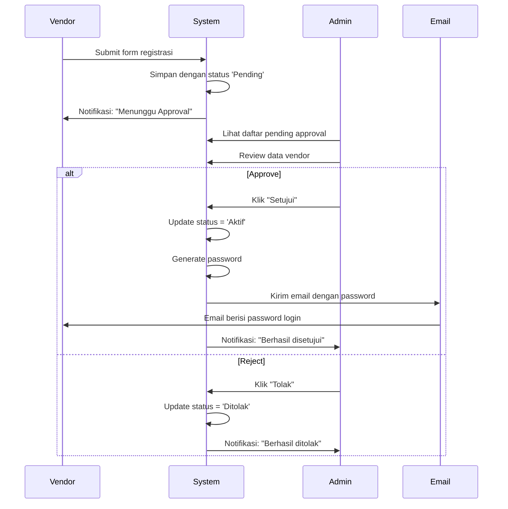

# FIX: Vendor Langsung Disetujui Tanpa Approval Admin

## 🐛 Masalah

Ketika vendor mendaftar melalui form registrasi, status akun mereka **langsung menjadi "Disetujui"** padahal seharusnya:
1. Status awal: **Pending** (Menunggu)
2. Admin review
3. Admin approve/reject
4. Status berubah menjadi **Aktif** (Disetujui) atau **Ditolak**

## 🔍 Penyebab

Di file migrasi database [`supabase/migrations/add_status_to_vendor_users.sql`](../supabase/migrations/add_status_to_vendor_users.sql), kolom `status` dibuat dengan **DEFAULT value 'Aktif'**:

```sql
-- CODE LAMA (BERMASALAH)
ALTER TABLE vendor_users ADD COLUMN status VARCHAR(50) DEFAULT 'Aktif';
UPDATE vendor_users SET status = 'Aktif' WHERE status IS NULL;
```

Ini menyebabkan setiap vendor baru yang mendaftar otomatis mendapat status "Aktif" meskipun code aplikasi mencoba set status 'Pending'.

## ✅ Solusi yang Sudah Diterapkan

### 1. **Update Migration File**
File: [`supabase/migrations/add_status_to_vendor_users.sql`](../supabase/migrations/add_status_to_vendor_users.sql)

```sql
-- CODE BARU (SUDAH DIPERBAIKI)
ALTER TABLE vendor_users ADD COLUMN status VARCHAR(50) DEFAULT 'Pending';
UPDATE vendor_users 
SET status = 'Pending' 
WHERE status IS NULL 
  AND is_activated = false 
  AND password = 'PENDING_APPROVAL';
```

### 2. **Fix Database Default Value**
File: [`database/FIX_VENDOR_STATUS_DEFAULT.sql`](./FIX_VENDOR_STATUS_DEFAULT.sql)

Script SQL untuk mengubah DEFAULT value di database yang sudah running.

## 🛠️ Cara Menerapkan Fix

### **Jalankan SQL Script di Supabase**

1. Buka **Supabase Dashboard** → **SQL Editor**
2. Copy paste script dari file [`FIX_VENDOR_STATUS_DEFAULT.sql`](./FIX_VENDOR_STATUS_DEFAULT.sql)
3. Klik **Run**
4. Verifikasi hasilnya:

```sql
-- Cek DEFAULT value sudah berubah
SELECT column_default 
FROM information_schema.columns 
WHERE table_name = 'vendor_users' 
  AND column_name = 'status';

-- Seharusnya menampilkan: 'Pending'::character varying
```

## 📋 Verifikasi Fix Berhasil

### Test Pendaftaran Vendor Baru:

1. **Buka halaman login vendor** → Klik "Daftar Sekarang"
2. **Isi form registrasi** dengan data lengkap
3. **Submit** pendaftaran
4. **Cek di Admin Dashboard** → "Approval Akun Vendor"
5. **Status seharusnya "Menunggu"** bukan "Disetujui"

### Expected Behavior:
```
Status Awal: 🟡 Menunggu (Pending)
                ↓
        Admin Review
                ↓
    ✅ Disetujui / ❌ Ditolak
```

## 📊 Alur Registrasi yang Benar



## 🔐 Status Vendor Explained

| Status | Deskripsi | Icon | Aksi Admin |
|--------|-----------|------|------------|
| **Pending** | Menunggu approval admin | 🟡 ⏱️ | Review → Approve/Reject |
| **Aktif** | Sudah disetujui, bisa login | 🟢 ✅ | Bisa deactivate |
| **Ditolak** | Ditolak oleh admin | 🔴 ❌ | Bisa delete |

## 📝 Catatan Penting

### ⚠️ Data Existing
- Fix ini **TIDAK** mengubah data vendor yang sudah ada
- Vendor yang sudah status "Aktif" akan tetap "Aktif"
- Hanya mempengaruhi **pendaftaran BARU** setelah fix diterapkan

### 🔄 Jika Ada Vendor Pending yang Salah
Jika ada vendor yang seharusnya "Pending" tapi sudah jadi "Aktif", bisa manual update:

```sql
-- Update vendor tertentu kembali ke Pending
UPDATE vendor_users 
SET status = 'Pending', 
    is_activated = false,
    password = 'PENDING_APPROVAL'
WHERE email = 'email_vendor@example.com';
```

## 🎯 Files yang Diubah

1. ✅ [`supabase/migrations/add_status_to_vendor_users.sql`](../supabase/migrations/add_status_to_vendor_users.sql) - DEFAULT 'Pending'
2. ✅ [`database/FIX_VENDOR_STATUS_DEFAULT.sql`](./FIX_VENDOR_STATUS_DEFAULT.sql) - Fix database script

## ✨ Testing Checklist

- [ ] Jalankan SQL fix di Supabase
- [ ] Coba registrasi vendor baru
- [ ] Verifikasi status = "Pending" di approval page
- [ ] Admin approve vendor
- [ ] Verifikasi status berubah = "Aktif"
- [ ] Vendor terima email password
- [ ] Vendor bisa login dengan password

---

**Status**: ✅ Fixed  
**Tanggal**: 6 Februari 2026  
**Tested**: Perlu testing setelah apply SQL fix
