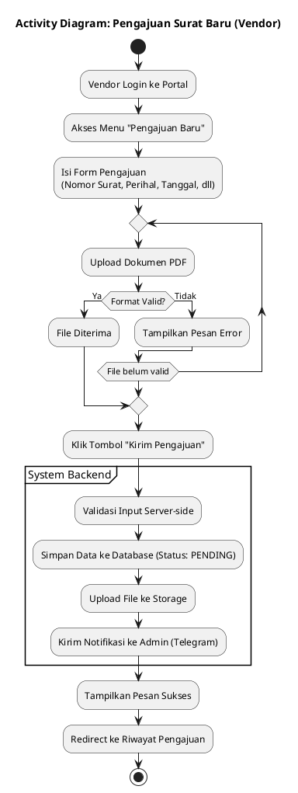
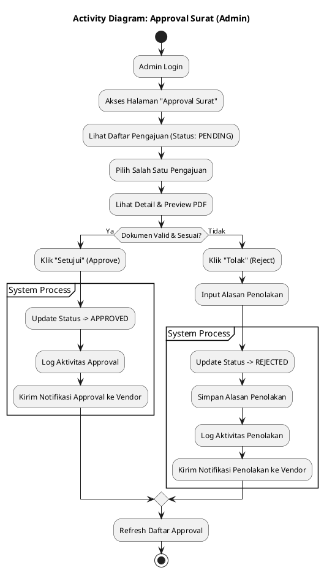
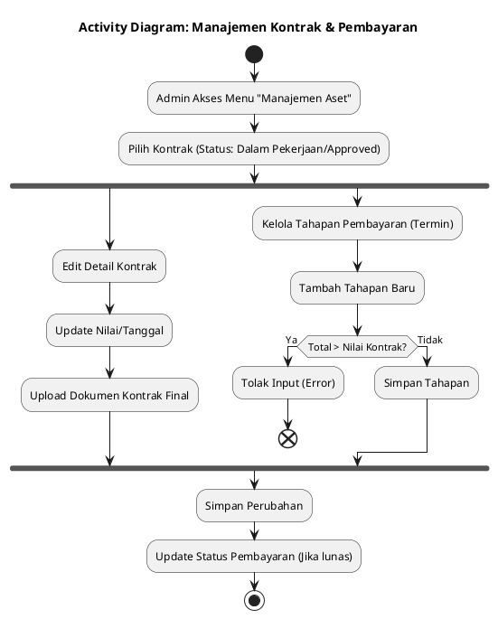
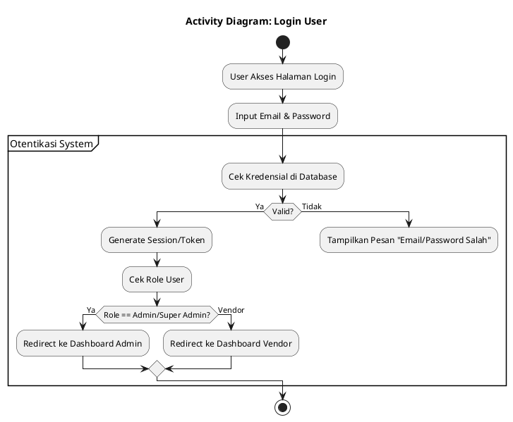

# System Activity Diagrams

Berikut adalah diagram aktivitas (Activity Diagram) yang menggambarkan alur kerja utama dalam sistem VLAAS.

## 1. Alur Pengajuan Surat (Vendor)

Diagram ini menjelaskan proses vendor saat membuat dan mengirimkan pengajuan surat baru.

## 2. Alur Approval Surat (Admin)

Diagram ini menjelaskan proses verifikasi yang dilakukan oleh Admin (Verifikator) terhadap pengajuan yang masuk.

## 3. Alur Manajemen Kontrak & Pembayaran (Admin)

Diagram ini menjelaskan proses admin mengelola kontrak aktif dan tahapan pembayarannya.

## 4. Alur Login (User)

Diagram alur otentikasi umum untuk Vendor dan Admin.

