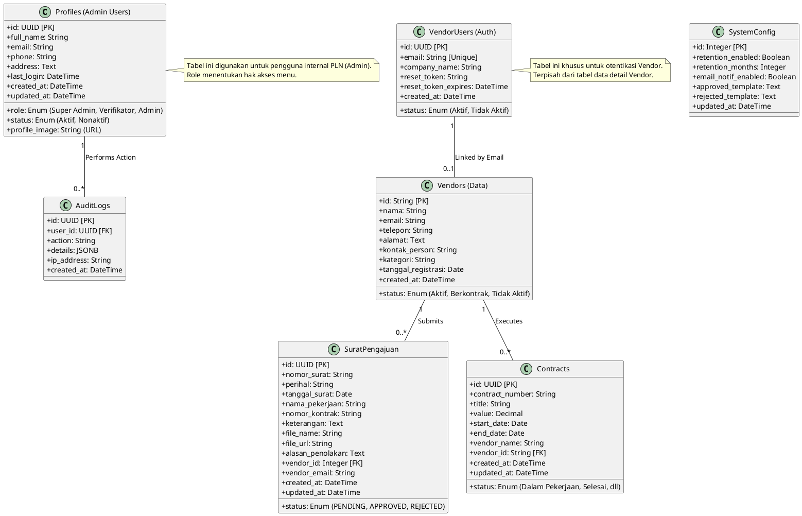

# System Class Diagram

Berikut adalah diagram kelas (Class Diagram) yang menggambarkan struktur database dan relasi antar entitas dalam sistem VLAAS.

## Penjelasan Entitas

### 1. Profiles (Admin Users)
Menyimpan data pengguna internal (pegawai PLN) yang memiliki akses ke dashboard admin.
*   **Role**: Menentukan otorisasi (Super Admin bisa kelola user lain, Verifikator hanya operasional).

### 2. VendorUsers & Vendors
Pemisahan antara akun login (`VendorUsers`) dan data perusahaan (`Vendors`).
*   **VendorUsers**: Digunakan untuk login dan reset password.
*   **Vendors**: Data detail perusahaan yang digunakan dalam kontrak dan surat.

### 3. SuratPengajuan
Menyimpan semua data pengajuan surat dari vendor.
*   **Status**: Mengontrol alur approval (PENDING -> APPROVED/REJECTED).
*   **File**: Menyimpan referensi ke file PDF di Supabase Storage.

### 4. Contracts (Manajemen Aset)
Menyimpan data kontrak kerja yang sedang berjalan atau sudah selesai.
*   Relasi ke Vendor memastikan setiap kontrak terhubung ke pelaksana pekerjaan.

### 5. AuditLogs
Mencatat setiap aksi penting yang dilakukan oleh Admin untuk keperluan tracing dan keamanan.

### 6. SystemConfig
Tabel tunggal (Single Row) untuk menyimpan preferensi sistem yang berlaku global, seperti template pesan dan kebijakan retensi data.
