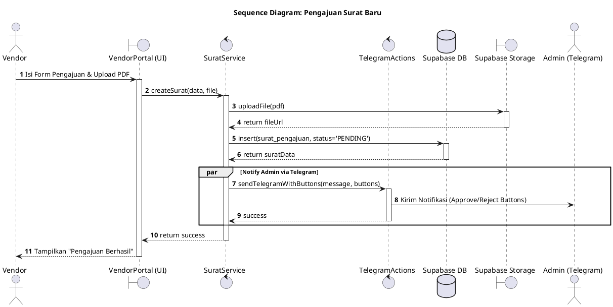
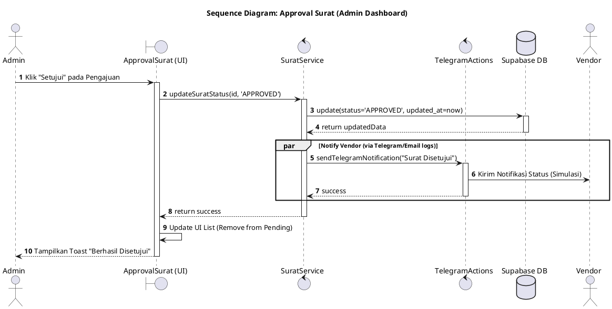
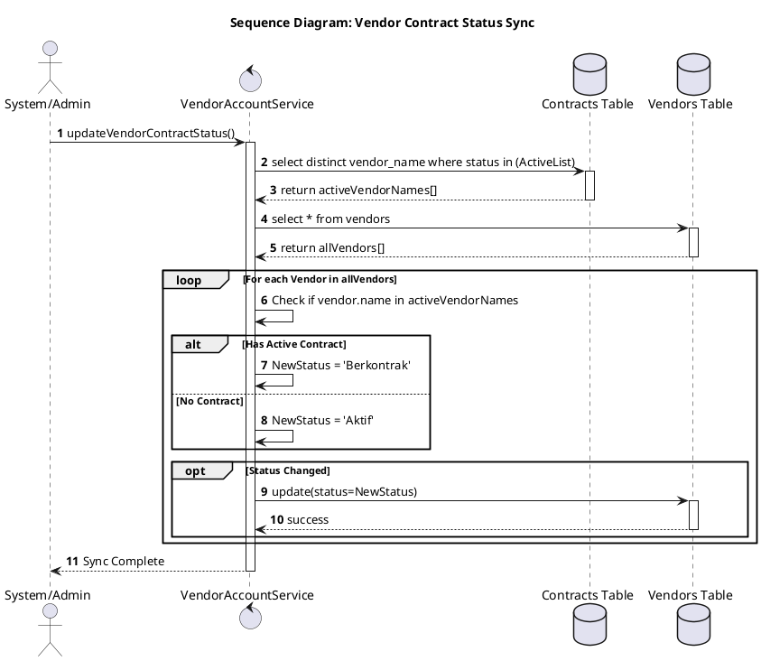

# System Sequence Diagrams

Berikut adalah diagram urutan (Sequence Diagram) yang menjelaskan interaksi antar objek/komponen dalam sistem VLAAS untuk skenario utama.

## 1. Sequence: Pengajuan Surat Baru (Vendor)

Menjelaskan aliran data saat vendor mengirimkan pengajuan surat, mulai dari UI hingga notifikasi Telegram.

## 2. Sequence: Approval Surat (Admin)

Menjelaskan proses admin menyetujui pengajuan melalui dashboard.

## 3. Sequence: Sinkronisasi Status Vendor (Auto-Sync)

Menjelaskan bagaimana sistem memperbarui status vendor secara otomatis berdasarkan kontrak aktif.

