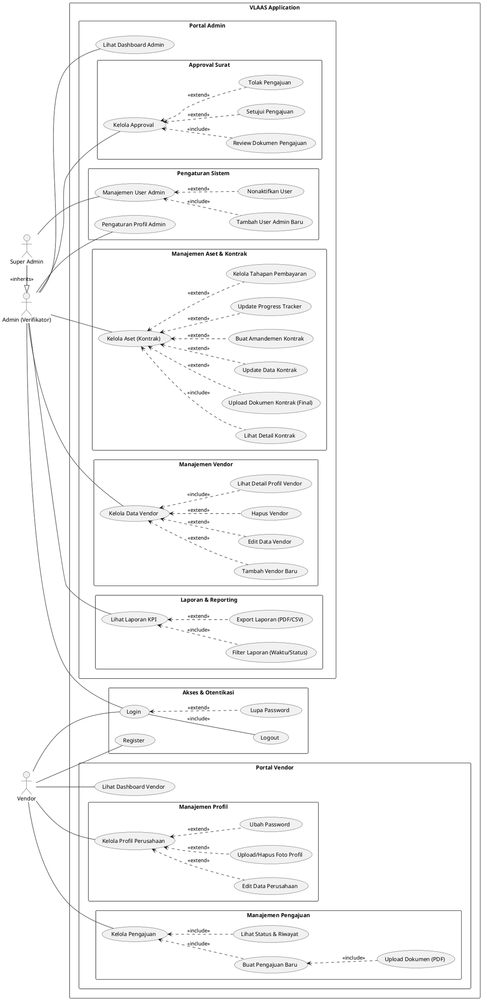

# System Use Cases

Berikut adalah kode PlantUML untuk Use Case Diagram program VLAAS yang telah diperbarui dengan detail fitur Admin dan penambahan peran Super Admin.

## Penjelasan Detail Aktor

### 1. Vendor
Pihak eksternal (rekanan) yang menggunakan aplikasi untuk mengajukan surat atau kontrak kerja.

### 2. Admin (Verifikator)
Pengguna internal PLN yang bertugas melakukan operasional harian:
*   **Approval Surat**: Memeriksa, menyetujui, atau menolak pengajuan vendor.
*   **Aset & Kontrak**:
    *   Mengupload dokumen kontrak final (PDF).
    *   Membuat amandemen jika ada perubahan kontrak.
    *   Mengupdate progress pekerjaan (0-100%).
    *   Mengatur termin pembayaran (Payment Stages).
*   **Manajemen Vendor**: Menambah, mengedit, atau menghapus data vendor secara manual.
*   **Laporan**: Melihat statistik, grafik kinerja, dan melakukan **Export ke PDF/CSV**.

### 3. Super Admin
Pengguna dengan hak akses tertinggi. Memiliki **semua kemampuan Admin**, ditambah hak khusus di menu **Pengaturan**:
*   **Manajemen User**: Dapat menambahkan akun Admin baru dengan role "Verifikator" atau "Super Admin".
*   **Keamanan**: Dapat menonaktifkan atau mengaktifkan kembali akun admin lain.
